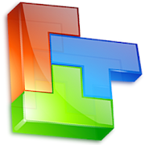
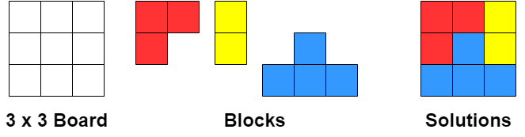

[](https://github.com/samabcde/block-puzzle-solver)
[](https://app.codecov.io/samabcde/block-puzzle-solver)

# Block Puzzle Solver



## Description

A program to solve [block puzzle game](https://play.google.com/store/apps/details?id=biz.mtoy.blockpuzzle.revolution)
Trying to optimize the program to solve.

## Definition

### Board

Board is a rectangle with width `w` and height `h`, where `w` and `h` are integer. It has `h` row and each row has `w`
points`(x, y)` hence the total number of points on the board is `w * h`

### Block

Block is a set of points in `(x, y)`. the number of points of the block is said to be `weight` of the block. Block can
not be rotated or reflected.

### Block Position

Block Position is the position `(px, py)` of block on the board. Each points `(x, y)` of the block will be mapped to `(x+px, y+py)`.

### Puzzle

A puzzle consists of a board, and a set of blocks. Total number of points of the board equals total weight of the
blocks.

A puzzle is said to be solvable, if there exist a block position for each block, such that each points of each block is
mapped to one and only one point of the board. Otherwise, the puzzle is unsolvable.

#### Example


## Usage

Build the jar with maven
```
mvn clean package
```
Then inside the project target folder run, using above [Example](#example)
```
java -jar block-puzzle-solver-0.0.1-SNAPSHOT-jar-with-dependencies.jar  --puzzle-width 3 --puzzle-height 3 --blocks "11,1;1,1;01,111"
```
